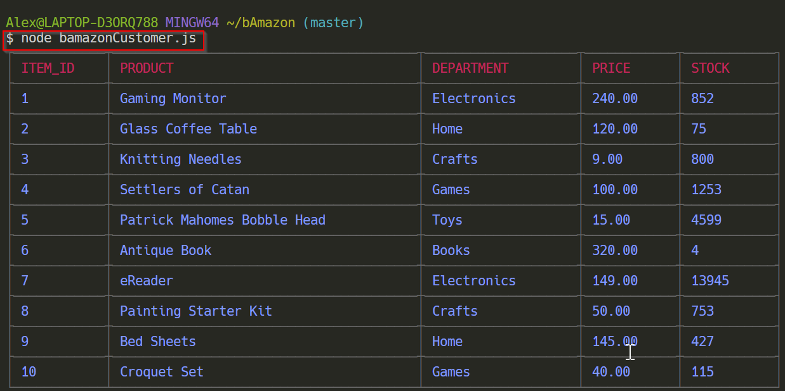
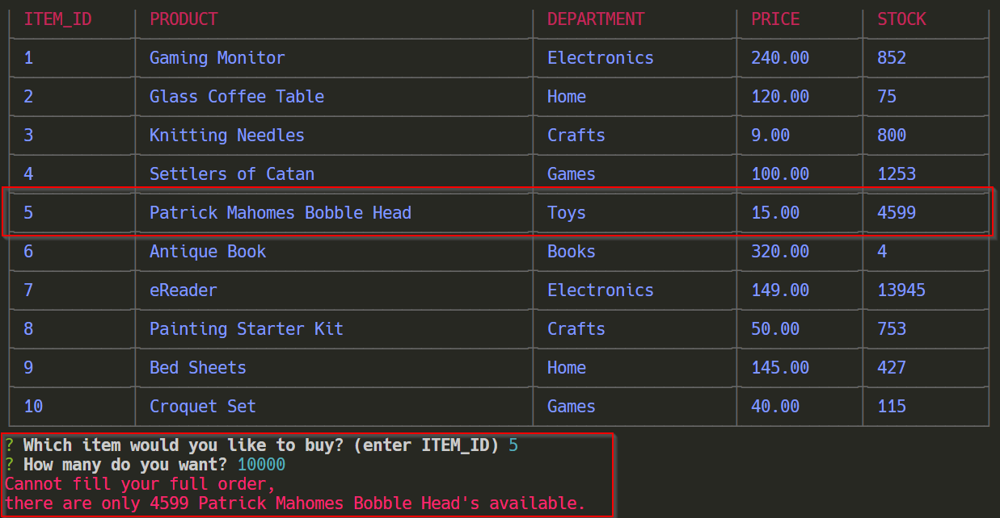
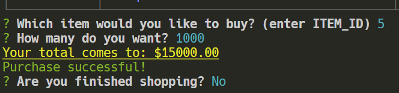
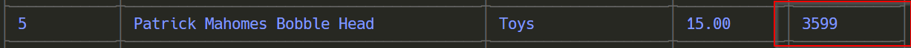

# bAmazon

bAmazon is a CLI marketplace. The customer can view and purchase available products from a MySQL table. bAmazon will update available inventory and display cost of order based on the customer's inputs.

## Getting Started

1. Clone this repo
1. Install Node and packets
1. Create a database with bamazon.sql
1. run node bamazonCustomer.js in the command prompt

Enter a valid ITEM_ID for a product you would like to purchase (*pay attention to the available stock, you cannot purchase more than is available*)

For example, let's say the Kansas City Chiefs want to buy 10,000 'Patrick Mahomes Bobble Heads' for a promotion. 

They would have entered '5' for the ITEM_ID and '10000' for the amount. An error message will follow because the order is too big:

The app will then restart, and the order can be ammended. Let's say they want buy 1,000 instead. A total $ amount is logged and the user can continue shopping. 

If they are finished, the app will quit. If they are not finsihed, the app will restart and available stock is adjusted.

## Thank you for shopping!

## Powered by:

* MySQL
* Node.js
* JavaScipt
    * NPM inquirer
    * NPM mysql
    * NPM cli-table
    * NPM chalk
